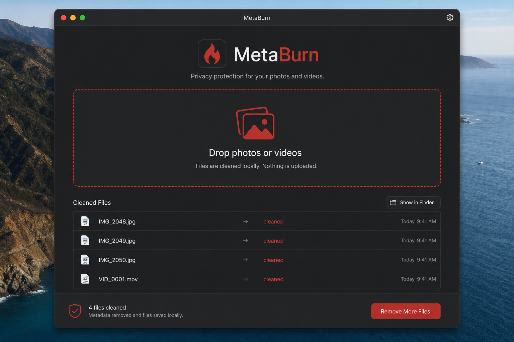

# MetaBurn

[](https://github.com/RazorBackRoar/MetaBurn/releases/latest)
[](https://github.com/RazorBackRoar/MetaBurn/releases/tag/v2.2.10)
[](https://github.com/RazorBackRoar/MetaBurn/actions/workflows/ci.yml)
[](LICENSE)
[](https://swift.org/)
[](https://support.apple.com/en-us/HT211814)

<!-- Workspace Health Layer -->


**Strip EXIF, GPS, and device metadata from photos and videos — locally on macOS.**

Click **Open Files**, then drag media into MetaBurn. The app copies each file into its private workspace before cleaning and verification. Originals are never moved, renamed, overwritten, deleted, or modified. Optional audio removal permanently omits video audio tracks.

Photo cleans use Image I/O at **maximum practical JPEG quality** (`kCGImageDestinationLossyCompressionQuality = 1.0`) while stripping privacy metadata. HEIC/HEIF become cleaned `.jpg`. Videos prefer remux (no visual re-encode).

<p align="center">
  <a href="https://github.com/RazorBackRoar/MetaBurn/releases/latest/download/MetaBurn.dmg"><strong>↓ Download MetaBurn.dmg</strong></a>
  ·
  <a href="https://github.com/RazorBackRoar/MetaBurn/releases">All releases</a>
</p>



## Features

- **Local-first privacy** — metadata stays on your Mac; nothing is uploaded
- **Drag-and-drop** — drop photos and videos together onto the window
- **Safe by default** — writes cleaned copies; originals never overwritten
- **Max-quality photo strip** — JPEG quality **1.0** for HEIC conversion and for stripping existing JPG/JPEG/other stills
- **HEIC / HEIF → `.jpg`** — single-pass convert + strip (creator-friendly `.jpg` extension)
- **EXIF / GPS / device tags** — stripped natively (ImageIO for photos, AVFoundation for videos)
- **Optional video mute** — omit audio tracks from cleaned video copies (no quality re-encode when passthrough works)
- **Private workspace** — verified copies live under MetaBurn’s internal `Open Files/Photos` and `Open Files/Videos` folders
- **iCloud Drive (optional)** — drops from iCloud work; online-only files download first (can be slow)
- **Apple Silicon native** — Swift / SwiftUI · no Homebrew tools required

## Install

1. Download [`MetaBurn.dmg`](https://github.com/RazorBackRoar/MetaBurn/releases/latest/download/MetaBurn.dmg)
2. Open the DMG and drag **MetaBurn.app** to `/Applications`
3. First launch — right-click → **Open** (ad-hoc signed build)

Requires macOS on Apple Silicon.

## Usage

1. Open **MetaBurn** and click **Open Files**
2. Drop photos and/or videos onto the window (mixed batches are fine)
3. Open **Photos** or **Videos** inside the private workspace
4. Select one or more verified copies and drag or copy them wherever you want
5. Enable **Remove audio** when cleaned video copies should contain no audio tracks

Unsupported files (GIF, WebM, AVI, MKV, etc.) are not imported. Their originals remain untouched.

## Supported formats

| Category | Extensions |
|----------|------------|
| Photos | jpg, jpeg, png, heic, heif, webp, tiff, bmp, jp2 |
| Videos | mov, mp4, m4v |
| Unsupported | gif, webm, avi, mkv, and other types MetaBurn cannot clean safely |

Duplicate output names use zero-padded suffixes (`photo-001.jpg`, not `-1`).

## Development

```bash
swift build
swift run
swift test   # requires full Xcode.app
```

Package a macOS `.app` + DMG (ad-hoc signed) **inside this repo**:

```bash
./scripts/build-mac.sh
# → build/Release/MetaBurn.dmg
# → build/Release/MetaBurn.app (used while packaging; DMG is the ship artifact)
```

## Docs

- [docs/ARCHITECTURE.md](docs/ARCHITECTURE.md) — MetaBurnCore vs app layers, services
- [BUILD_AND_RELEASE.md](BUILD_AND_RELEASE.md)
- [docs/HEIC-ICLOUD-IMPLEMENTATION-PLAN.md](docs/HEIC-ICLOUD-IMPLEMENTATION-PLAN.md)
- [CONTRIBUTING.md](CONTRIBUTING.md)
- [SECURITY.md](SECURITY.md)
- [CODE_OF_CONDUCT.md](CODE_OF_CONDUCT.md)

## License

MIT — see [LICENSE](LICENSE).
