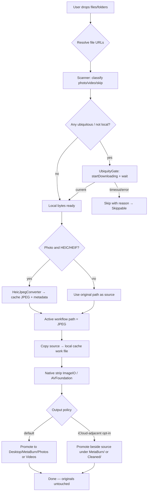

# MetaBurn Development Plan — HEIC→JPEG + iCloud Drive

**Status:** Implemented in MetaBurn 2.1.0 — kept as architecture reference  
**App version baseline:** 2.1.0 (`Sources/MetaBurn/Resources/version.json`)  
**Current developer map:** [docs/ARCHITECTURE.md](ARCHITECTURE.md), `AGENTS.md`  
**Date:** 2026-07-30

---

## Executive summary

MetaBurn today is a **non-sandboxed**, **drag-and-drop-only** Swift/SwiftUI app that:

1. Scans dropped paths (`Scanner`)
2. Copies each file into a **local Application Support cache work file** (`Paths.workURL`)
3. Strips metadata natively (`NativeImageIO` / `NativeVideoClean`)
4. Promotes cleaned copies to **`~/Desktop/MetaBurn/{Photos,Videos,Skippable}`**
5. **Never overwrites originals**

This plan adds:

| Feature | Intent | Recommended approach |
|---------|--------|----------------------|
| **F1 — HEIC/HEIF → JPEG** | Automatic, transparent, max practical quality, preserve metadata into the JPEG used for subsequent cleaning | New `HeicJpegConverter` using **Image I/O** (`CGImageSource` → `CGImageDestination` JPEG @ quality **1.0**), run as a **pre-clean stage** that replaces the *workflow path* with a cache JPEG |
| **F2 — iCloud Drive** | Process files from iCloud Drive without a Desktop staging copy | **Drag-and-drop + coordinated read of user’s iCloud Drive paths** (`NSFileCoordinator` + ubiquity download status). Keep **local cache for mutation**; write **cleaned outputs** either beside source (opt-in) or to Desktop (default). Do **not** require MetaBurn’s own iCloud container for reading user Drive files |

Two product rules in `AGENTS.md` conflict with the raw feature brief and must be resolved before coding:

1. **“Drag-and-drop only forever — never add browse / file-picker UI”** vs “select folders within iCloud Drive.”
2. **“Originals are never overwritten”** vs “process in place / save modified files back into iCloud Drive.”

**Recommendation (locked unless product overrides):**

- Keep **drag-and-drop as the only import surface** (folders from iCloud Drive already work when dropped). No Open panel.
- Keep **never overwrite originals**. “In place” means: *read from iCloud path without forcing a Desktop intermediate*; cleaned/converted results land in a **sibling output policy** (see §5), not by replacing the source file.

---

## 1. Recommended architecture

### 1.1 Pipeline (target)

```text
Drop (local or iCloud Drive URLs)
        │
        ▼
┌───────────────────────┐
│  UbiquityGate         │  ensure downloaded / coordinated read
│  (new)                │
└───────────┬───────────┘
            ▼
┌───────────────────────┐
│  Scanner              │  classify + walk (existing)
└───────────┬───────────┘
            ▼
┌───────────────────────┐
│  WorkflowNormalize    │  HEIC/HEIF → high-quality JPEG in cache
│  (new; F1)            │  replace active path for rest of job
└───────────┬───────────┘
            ▼
┌───────────────────────┐
│  MetadataCleaner      │  copy → strip → promote (existing shape)
│                       │  output root: Desktop OR source-adjacent
└───────────────────────┘
```

### 1.2 New / changed modules

| Module | Layer | Role |
|--------|-------|------|
| `Sources/MetaBurn/Services/HeicJpegConverter.swift` | App | Image I/O HEIC/HEIF → JPEG @ quality 1.0 + metadata/color/gain-map best effort |
| `Sources/MetaBurnCore/HeicRules.swift` | Core | Pure detection helpers (ext + UTI), unit-tested |
| `Sources/MetaBurn/Services/UbiquityGate.swift` | App | Detect ubiquitous items, start download, wait with timeout, coordinated copy into cache |
| `Sources/MetaBurn/Services/OutputRootResolver.swift` | App | Choose Desktop vs source-adjacent output root per job |
| `Sources/MetaBurn/Services/MetadataCleaner.swift` | App | Call normalize before clean; accept resolved output dirs |
| `Sources/MetaBurn/Services/TaskRunner.swift` | App | Preflight ubiquity for scanned set; progress for “Downloading from iCloud…” |
| `Sources/MetaBurn/Utilities/Paths.swift` | App | Keep work files in local cache; never write temps under iCloud |
| `Tests/MetaBurnTests/` | Tests | HeicRules + OutputNaming for `.heic` → `.jpg` naming |

### 1.3 Why not “true in-place rewrite”

Writing JPEG/cleaned bytes directly onto an iCloud-synced path mid-sync races the daemon, creates conflict versions, and violates MetaBurn’s safety model (orphaned `.metaburn.tmp` history led to **local-only** work files — see `WorkFileSafety` / `OutputNaming.workURL(in:)`).

**Apple-aligned pattern:** coordinated **read** of ubiquitous item → mutate in **local non-ubiquitous** storage → coordinated **write** of a **new** destination URL.

---

## 2. API / framework comparison

### 2.1 HEIC → JPEG

| Approach | Pros | Cons | Verdict |
|----------|------|------|---------|
| **Image I/O** (`CGImageSource` + `CGImageDestination` + `UTType.jpeg`) | Public, already used by MetaBurn; direct metadata dictionaries; `kCGImageDestinationLossyCompressionQuality`; `AddImageFromSource` can carry tags; gain-map keys exist (`kCGImageDestinationPreserveGainMap`) | Format change always re-encodes pixels; HEIC HDR → baseline JPEG has fidelity limits | **Primary (recommended)** |
| **Core Image** (`CIContext.writeJPEGRepresentation`) | Convenient color management; HDR/gain-map options in recent SDKs | Heavier; easier to drop MakerApple / EXIF unless carefully plumbed; less aligned with existing strip path | Optional fallback for HDR edge cases |
| **CGImage + manual encode** | Fine control | More code; same Image I/O destination underneath | Unnecessary |
| **Photos / PHAsset** | Good for library assets | Wrong domain (iCloud Photos ≠ iCloud Drive files) | Out of scope |
| **Third-party (libjpeg-turbo, etc.)** | Extra knobs | Breaks “native-only / no Homebrew runtime deps” product line | **Rejected** |

**Recommended conversion call shape (Image I/O):**

1. `CGImageSourceCreateWithURL` with `kCGImageSourceShouldCache: false`
2. Confirm UTI is HEIC/HEIF (`CGImageSourceGetType` / `UTType.heic` / `.heif`)
3. `CGImageSourceCopyPropertiesAtIndex` → mutable options dict
4. Set `kCGImageDestinationLossyCompressionQuality = 1.0` (**required** for Apple’s highest practical JPEG path — enables 4:4:4 chroma vs 4:2:0 at &lt; 1.0)
5. Prefer `CGImageDestinationAddImageFromSource` so Image I/O can transfer metadata containers; if that fails or retains HEIF-only bags incorrectly, fall back to decode + `CGImageDestinationAddImage` with copied EXIF/GPS/TIFF/IPTC + orientation + ICC
6. Attempt gain-map preservation via documented destination options (`kCGImageDestinationPreserveGainMap` when available) / auxiliary data APIs; if JPEG cannot host the map, document SDR baseline as accepted limitation
7. `CGImageDestinationFinalize` to a **cache** URL (`*.metaburn.tmp.jpg`)
8. Hand that path to `MetadataCleaner` as the active workflow file (original HEIC untouched)

**Do not** use `CGImageDestinationCopyImageSource` for HEIC→JPEG — QA1895 applies to same-container metadata edits (JPEG/PNG/PSD/TIFF), not format conversion.

### 2.2 iCloud Drive access

| Approach | Pros | Cons | Verdict for MetaBurn |
|----------|------|------|----------------------|
| **User-granted paths (drag-drop / security-scoped)** | Matches current UX; works with `~/Library/Mobile Documents/com~apple~CloudDocs/…` | Must handle placeholders / downloads | **Primary** |
| **App iCloud container** (`url(forUbiquityContainerIdentifier:)`, `NSUbiquitousContainers`) | Apple “documents in iCloud” story | Creates *MetaBurn’s* Drive folder; does **not** grant access to arbitrary user folders | Only if shipping a MetaBurn Documents folder later — **not** required for F2 |
| **NSMetadataQuery** (ubiquitous scopes) | Discover app-container docs | Wrong tool for arbitrary Drive drops | Skip for F2 |
| **NSDocument / document-based app** | Full presenter lifecycle | Large architectural rewrite; conflicts with drop-only utility UX | **Not recommended** |
| **File Provider Extension** | Deep Finder integration | Separate target, overkill | **Out of scope** |

**Required coordination APIs:**

- `URL.resourceValues` — `isUbiquitousItemKey`, `ubiquitousItemDownloadingStatusKey`, `ubiquitousItemIsDownloadingKey`, `ubiquitousItemDownloadingErrorKey`
- `FileManager.startDownloadingUbiquitousItem(at:)`
- `NSFileCoordinator.coordinate(readingItemAt:options:error:byAccessor:)` for the byte copy into cache
- `NSFileCoordinator.coordinate(writingItemAt:…)` when promoting output into an iCloud destination folder

---

## 3. Workflow diagram (import → export)



### Stage ownership

| Stage | Owner today | Change |
|-------|-------------|--------|
| Drop → paths | `ContentView` (`UTType.fileURL`) | Start security-scoped access if present; no picker |
| Scan | `Scanner` | Optionally skip `.icloud` placeholder names; rely on UbiquityGate for real files |
| Download | — | **New** `UbiquityGate` before clean loop |
| HEIC convert | — | **New** before `MetadataCleaner.cleanFile` |
| Clean | `MetadataCleaner` | Source may already be cache JPEG; output naming must use `.jpg` |
| Output | `Paths` / `OutputNaming` | Pluggable root |

---

## 4. Image quality & metadata preservation (F1)

### 4.1 Quality

| Setting | Effect (Apple Image I/O / observed behavior) |
|---------|-----------------------------------------------|
| `kCGImageDestinationLossyCompressionQuality = 1.0` | Highest quality path; documentation: “lossless if destination format supports it.” JPEG is lossy, but **1.0** selects Apple’s max-quality encode (typically **4:4:4** chroma). |
| Values &lt; 1.0 | Smaller files; typically **4:2:0** chroma — more visible degradation on edges/text. |

**Ship default: `1.0`.** Document that JPEG cannot be bit-identical to HEIC; “highest practical quality using public APIs” means quality 1.0 + preserve ICC + orientation + metadata bags.

### 4.2 Metadata to carry into JPEG (pre-strip)

Preserve into the intermediate JPEG whenever Image I/O accepts them:

- Orientation (`kCGImagePropertyOrientation`)
- Color profile / ICC (via source properties / embedded profile)
- EXIF (dates, lens, exposure, etc.)
- GPS
- TIFF Make/Model/Software (as present)
- IPTC where representable in JPEG
- File creation/modification times on the **cache file** via `FileManager.setAttributes` after write (optional nicety; strip stage still removes privacy tags from *content*)

After conversion, **existing** `NativeImageIO.stripMetadata` runs on the JPEG — so preserved tags exist only long enough for a faithful re-encode, then MetaBurn’s privacy strip proceeds as today.

### 4.3 Color / wide gamut / HDR

| Topic | Guidance |
|-------|----------|
| Display P3 / wide color | Prefer `AddImageFromSource` so ICC travels; avoid forcing sRGB unless write fails |
| HDR / gain maps (iPhone HEIC) | Traditional JPEG is 8-bit; full ISO HDR in baseline JPEG is not equivalent to HEIF. Prefer preserving gain-map auxiliary data when JPEG destination supports it (`PreserveGainMap` / ISO gain map aux). If unsupported, convert **SDR baseline** and log `hdr_gain_map_dropped` |
| Depth / portrait aux | Out of scope for v1 unless trivial to copy; skip with log |
| Live Photo pair (HEIC + MOV) | Treat as separate files (already); converting HEIC does not rewrite the video companion |

### 4.4 Transparent UX

- No extra button or dialog for conversion
- Progress copy: `Converting HEIC…` then existing `Saving cleaned copies…`
- Log entry shows source `.heic` → output `.jpg` path
- Original HEIC remains on disk untouched

### 4.5 Detection

Prefer **UTI from Image I/O** over extension alone (files named `.jpg` that are HEIF are rare but UTI is authoritative). Extension gate in `SupportedTypes` already includes `.heic` / `.heif` — keep that for scan, confirm at convert time:

```swift
// Conceptual
UTType(filenameExtension:) // .heic / .heif
CGImageSourceGetType(source) // public.heic / public.heif
```

---

## 5. iCloud Drive interaction (F2)

### 5.1 What “native iCloud Drive workflow” means for MetaBurn

| User action | Behavior |
|-------------|----------|
| Drop files from iCloud Drive (Finder) | Accepted like local drops |
| Drop an iCloud Drive folder | Recursive walk after ensuring children are downloadable |
| File is online-only placeholder | Auto `startDownloadingUbiquitousItem`; wait with progress + cancel |
| Clean / convert | Always mutate in **local cache** (`~/Library/Caches/MetaBurn` or Application Support cache — already the rule) |
| Save results | **Default:** `~/Desktop/MetaBurn/…` (unchanged). **Opt-in setting:** write cleaned JPEG/video into a `MetaBurn` (or `Cleaned`) subdirectory **next to the source folder** inside the same iCloud tree, using coordinated writes |

This satisfies “without requiring files to be copied to the Desktop **as a working directory**” while preserving the safety invariant that work files never live on iCloud.

### 5.2 Safe read algorithm

```text
for each source URL:
  values = resourceValues([isUbiquitousItem, downloadingStatus, isDownloading, downloadingError])
  if isUbiquitous && status != .current:
      startDownloadingUbiquitousItem(url)
      poll/wait until .current or timeout or cancel
  NSFileCoordinator.coordinate(readingItemAt: url) { readURL in
      copy readURL → local cache work/source staging
  }
  proceed with HEIC convert / clean on local bytes only
```

Never call Image I/O / AVFoundation directly on a non-current ubiquitous URL without coordination — reads can block for a long time or fail mid-decode.

### 5.3 Safe write algorithm (source-adjacent mode)

```text
finalURL = unique sibling under chosen iCloud output folder
write fully to local cache workURL
NSFileCoordinator.coordinate(writingItemAt: finalURL, options: .forReplacing) { writeURL in
    move/copy workURL → writeURL
}
strip stalling xattrs on the *local* work file before encode (existing WorkFileSafety)
```

Do **not** leave `*.metaburn.tmp*` in iCloud folders (daemon syncs partial files).

### 5.4 Offline / sync delays

| Situation | UX |
|-----------|-----|
| Offline + not downloaded | Fail that file: `iCloud file unavailable offline` → Skippable / failed log |
| Download slow | Per-file status + Cancel stops wait |
| Upload conflict after write | Accept Apple’s conflict versions; never overwrite user’s original |
| Desktop itself is iCloud-synced | Already mitigated: work files stay in local cache (`OutputNaming` comment) |

### 5.5 Entitlements & sandbox

**Current packaging** (`scripts/build-mac.sh`): ad-hoc or Developer ID sign; **no App Sandbox entitlements plist**. Dragged paths work as a normal macOS app.

| If MetaBurn stays non-sandboxed | F2 needs no iCloud entitlement to read user Drive paths the user drops |
| If MetaBurn later adopts App Sandbox | Need security-scoped bookmarks for retained access; `com.apple.security.files.user-selected.read-write`; optional iCloud entitlements only for **app container** documents — still not a substitute for user-selected Drive folders |

**Recommendation:** remain non-sandboxed for this feature set; still use `NSFileCoordinator` and start security-scoped access on drop URLs when the system provides them (harmless / forward-compatible).

### 5.6 Conflict with “select folders” requirement

Implement folder access via **dropping folders from Finder** (including iCloud Drive sidebar). Adding `NSOpenPanel` would violate MetaBurn’s locked UX in `AGENTS.md`. If product later insists on a button, treat it as an explicit AGENTS.md amendment.

---

## 6. Performance (Apple Silicon)

| Area | Practice |
|------|----------|
| Image I/O | `kCGImageSourceShouldCache: false` for one-shot convert/strip; avoid double full decodes when possible (`AddImageFromSource`) |
| Concurrency | Convert+clean remain **sequential per job** initially (matches today’s TaskRunner loop); optional `TaskGroup` with low concurrency (2–3) later for large HEIC batches |
| Memory | Prefer URL destinations over holding full `Data` for multi-hundred-MB HEICs |
| Disk | Cache on local APFS volume; never mid-write to iCloud |
| Download wait | Async polling on cooperative tasks; don’t block main actor |
| Quality 1.0 | Larger JPEGs — acceptable for “highest practical quality”; document disk use |

---

## 7. Security, sandbox, entitlements

| Item | Requirement |
|------|-------------|
| Codesign | Existing ad-hoc / Developer ID flow unchanged |
| App Sandbox | Not required for F1/F2 as packaged today |
| iCloud capability | **Not required** for reading user iCloud Drive via drop |
| Hardened Runtime | Already used when Developer ID signing (`--options runtime`) |
| Privacy | Intermediate JPEG may briefly contain GPS/EXIF in cache — ensure cache cleanup on success/failure (extend `cleanupOrphanWorkFiles`) |
| Quarantine / MACL | Keep `WorkFileSafety.stripStallingXattrs` on local work copies |

---

## 8. Edge cases, risks, limitations

| Risk | Mitigation |
|------|------------|
| HEIC sequence / burst multi-image | Convert **index 0** only (matches current strip); log if `GetCount > 1` |
| Alpha HEIF | JPEG has no alpha — composite on white via `kCGImageDestinationBackgroundColor` or reject to Skippable |
| Corrupted HEIC | Fail convert → fail clean with clear reason; discard work files |
| Naming: `IMG.HEIC` → cleaned `IMG.jpg` | Update `OutputNaming.uniqueURL` to allow extension rewrite when converter changed type |
| Double re-encode (HEIC→JPEG then strip re-encode) | Accept for correctness; future optimization: single Image I/O pass that converts **and** strips in one destination write (privacy-first path) — recommended Phase 2 optimization |
| “Preserve metadata” vs product purpose | Preserve only on intermediate; final output still stripped |
| In-place overwrite requests | Reject by policy; offer adjacent folder output |
| Finder `.icloud` stub files | Don’t treat as images; trigger download on the real URL when possible |
| Very large folders | Cap concurrent downloads; show counts |
| Legal/privacy | GPS preserved into intermediate then stripped — document in README |

---

## 9. Implementation phases

### Phase A — HEIC→JPEG (no iCloud changes) ✅ implemented

1. `HeicRules` + unit tests  
2. `HeicJpegConverter` (quality 1.0, metadata copy, cache output)  
3. Hook in `MetadataCleaner` before strip  
4. Output naming `.jpg`  
5. Manual tests under agent test tree: `/Users/home/Desktop/MetaBurn & Libra Test/photos`  
6. Docs / README note  

### Phase B — Ubiquity read path ✅ implemented

1. `UbiquityGate`  
2. Preflight in `TaskRunner` with UI status (`.downloading`)  
3. Coordinated copy into cache before convert/clean  
4. Offline / timeout → skipped/failed reasons  

### Phase C — Output policy ✅ implemented

1. Settings toggle: Desktop (default) vs “Save next to originals”  
2. `OutputRootResolver` + coordinated promote into iCloud destinations  
3. UI copy reflects chosen output label  

### Phase D — Single-pass optimize ✅ implemented

One Image I/O destination: HEIC source → JPEG **without** privacy dictionaries via `convertAndStrip` (orientation kept, quality 1.0).

---

## Locked product decisions

1. **Drag-and-drop only** — no Open panel; drop iCloud Drive folders/files.  
2. **Never overwrite originals** — local cache for mutation; Desktop or adjacent output only.  
3. **Output default** — Desktop/MetaBurn; optional adjacent via Settings.  
4. **HDR** — best-effort; SDR JPEG accepted when gain map cannot be stored (strip path does not preserve gain maps).  

## 10. Concrete file touch list

```text
Sources/MetaBurnCore/HeicRules.swift          (new)
Sources/MetaBurnCore/OutputDestination.swift  (new)
Sources/MetaBurnCore/OutputNaming.swift       (extension rewrite helper)
Sources/MetaBurn/Services/HeicJpegConverter.swift  (new)
Sources/MetaBurn/Services/UbiquityGate.swift       (new)
Sources/MetaBurn/Services/OutputRootResolver.swift (new)
Sources/MetaBurn/Services/MetadataCleaner.swift
Sources/MetaBurn/Services/TaskRunner.swift
Sources/MetaBurn/Services/SkipExporter.swift
Sources/MetaBurn/Views/ContentView.swift
Sources/MetaBurn/Views/SettingsView.swift
Sources/MetaBurn/Utilities/OutputPreference.swift (new)
Tests/MetaBurnTests/CoreTests.swift
README.md / AGENTS.md
```

---

## 11. References

### Image I/O / conversion / metadata

- [Working with Image Destinations](https://developer.apple.com/library/archive/documentation/GraphicsImaging/Conceptual/ImageIOGuide/ikpg_dest/ikpg_dest.html) — Image I/O Programming Guide  
- [CGImageDestination](https://developer.apple.com/documentation/imageio/cgimagedestination)  
- [kCGImageDestinationLossyCompressionQuality](https://developer.apple.com/documentation/imageio/kcgimagedestinationlossycompressionquality)  
- [kCGImageDestinationMetadata](https://developer.apple.com/documentation/imageio/kcgimagedestinationmetadata) / MergeMetadata  
- [CGImageProperties](https://developer.apple.com/documentation/imageio/cgimageproperties)  
- [Technical Q&A QA1895](https://developer.apple.com/library/archive/qa/qa1895/_index.html) — metadata without recompress (same-format only)  
- [Uniform Type Identifiers](https://developer.apple.com/documentation/uniformtypeidentifiers) — `UTType.heic`, `.heif`, `.jpeg`

### HDR / gain maps / color

- WWDC23: [Support HDR images in your app](https://developer.apple.com/videos/play/wwdc2023/10181/)  
- WWDC24: [Use HDR for dynamic image experiences in your app](https://developer.apple.com/videos/play/wwdc2024/10177/)  
- Image I/O destination options including gain-map preservation (SDK headers / `kCGImageDestinationPreserveGainMap`)  
- Core Image write APIs (`writeJPEGRepresentation` / HEIF representation options) as secondary reference

### iCloud / file coordination

- [Designing for Documents in iCloud](https://developer.apple.com/library/archive/documentation/General/Conceptual/iCloudDesignGuide/Chapters/DesigningForDocumentsIniCloud.html)  
- [iCloud File Management](https://developer.apple.com/library/archive/documentation/FileManagement/Conceptual/FileSystemProgrammingGuide/iCloud/iCloud.html)  
- [The Role of File Coordinators and Presenters](https://developer.apple.com/library/archive/documentation/FileManagement/Conceptual/FileSystemProgrammingGuide/FileCoordinators/FileCoordinators.html)  
- [FileManager.startDownloadingUbiquitousItem(at:)](https://developer.apple.com/documentation/foundation/filemanager/1411457-startdownloadingubiquitousitem)  
- [NSFileCoordinator](https://developer.apple.com/documentation/foundation/nsfilecoordinator)  
- URL resource keys: `ubiquitousItemDownloadingStatus`, `isUbiquitousItem`  
- HIG: document / Files behaviors (user-initiated access; clear progress for downloads)  
- Security-scoped bookmarks: [App Sandbox](https://developer.apple.com/documentation/security/app_sandbox) (forward-compat only)

### MetaBurn internal anchors

- `NativeImageIO.swift` — existing Image I/O strip (HEIC already handled as same-UTI re-encode)  
- `Paths.swift` / `WorkFileSafety.swift` — local cache work files; iCloud Desktop stall history  
- `AGENTS.md` — drag-drop only; never overwrite; Desktop output; native-only stack  

---

## 12. Open decisions (need product sign-off before Phase C)

1. **Output policy default** — keep Desktop-only, or add “Save next to originals” for iCloud drops?  
2. **Double encode vs single-pass strip+convert** — Phase A fidelity-first vs Phase D privacy-first single pass?  
3. **HDR** — hard-require gain-map preservation, or accept SDR JPEG when map cannot be stored?  
4. **Folder picker** — confirm drag-drop-only stands (recommended).

Once those are decided, Phase A can ship independently of iCloud.
